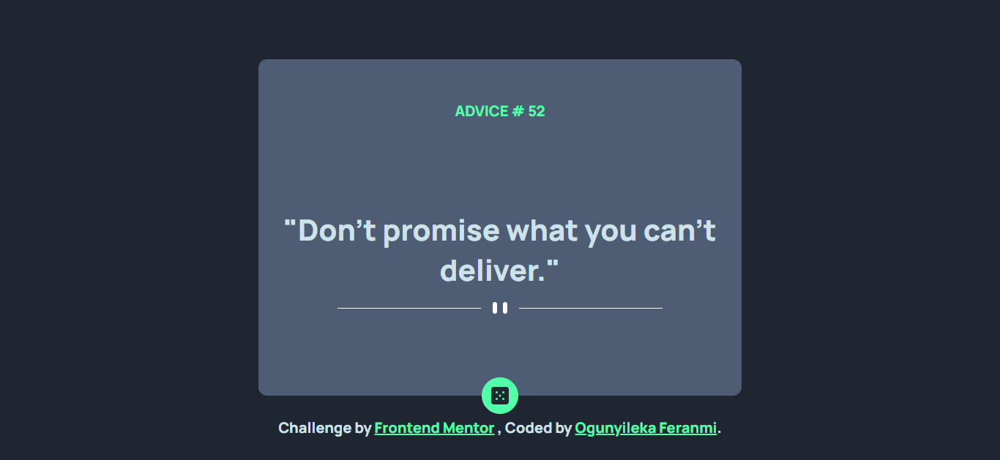

# Frontend Mentor - Advice generator app solution

This is a solution to the [Advice generator app challenge on Frontend Mentor](https://www.frontendmentor.io/challenges/advice-generator-app-QdUG-13db). Frontend Mentor challenges help you improve your coding skills by building realistic projects.

## Table of contents

- [Overview](#overview)
  - [The challenge](#the-challenge)
  - [Screenshot](#screenshot)
  - [Links](#links)
- [My process](#my-process)
  - [Built with](#built-with)
  - [Continued development](#continued-development)
- [Author](#author)

**Note: Delete this note and update the table of contents based on what sections you keep.**

## Overview

### The challenge

Users should be able to:

- View the optimal layout for the app depending on their device's screen size
- See hover states for all interactive elements on the page
- Generate a new piece of advice by clicking the dice icon

### Screenshot

### Links

- Solution URL: [https://github.com/Mayor-Isaac/Advice-API.git]
- Live Site URL:[https://idyllic-advice.netlify.app/]

## My process

### Built with

- Semantic HTML5 markup
- CSS custom properties
- Flexbox
- Mobile-first workflow
- [Advice API](https://api.adviceslip.com/) - Public Api

### Continued development
Application Programming Interface

## Author

- LinkedIn - [Feranmi Ogunyileka](https://www.linkedin.com/in/feranmi-ogunyileka-359a1723b)
- Frontend Mentor - [@Mayor-Isaac](https://www.frontendmentor.io/profile/Mayor-Isaac)
- Twitter - [@mayor_idyllic](https://www.twitter.com/mayor_idyllic)
